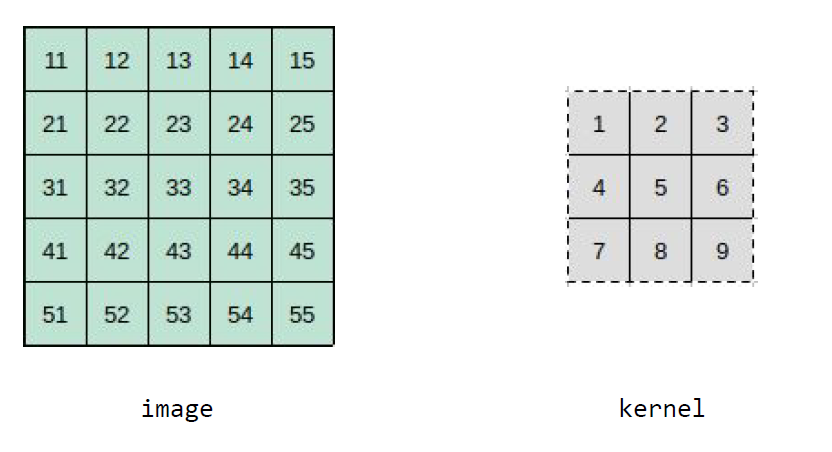
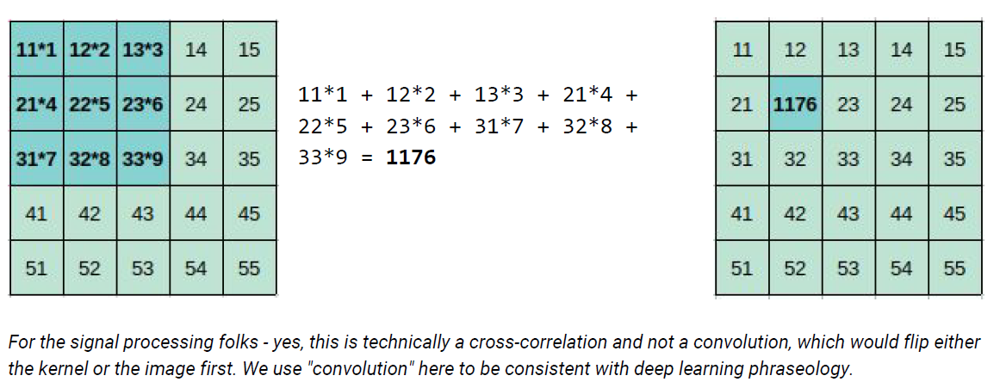
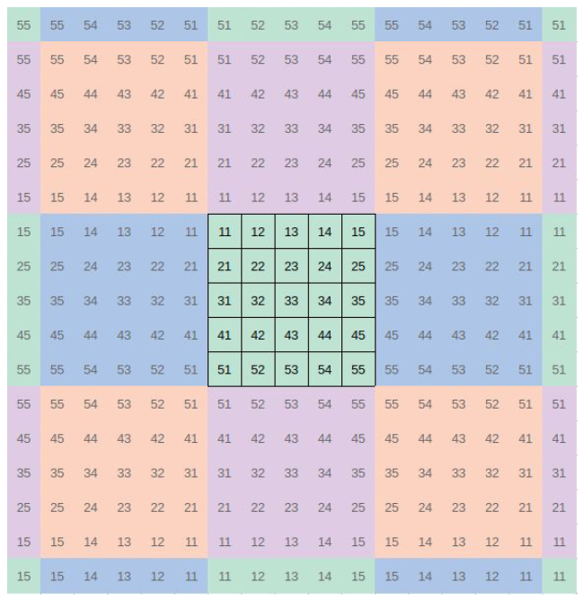
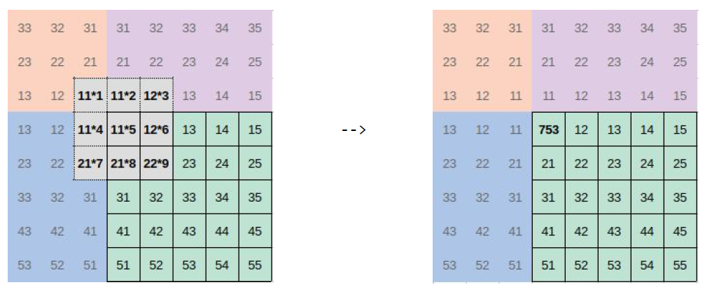

# Reflected-Convolution
***Implement a convolution algorithm that mirrors the pixels around the edges and perform reflected convolution***

In image processing, a kernel is a small matrix of weights that we might apply to an image for edge detection, blurring, sharpening, etc. This is typically achieved by convolution , where we weigh a pixel's neighbors by the values in the kernel and sum them. For example, say we have the following 5x5 image, and the following 3x3 kernel:

By convention, we say that the top-left pixel is coordinate (0, 0), with x-values increasing to the right and y-values increasing down.Let's apply our example kernel to the image at pixel location (1, 1), with value 22; we compute a new pixel value of 1176:

How do we handle edges? When the kernel extends beyond the image boundaries, we might zero-pad the image so that the product of the kernel and that pixel are set to 0 - but sometimes we don't want to lose that edge information. For this problem, we want to implement a convolution algorithm that mirrors the pixels around the edges. In the following figure, the green area is still the original image, but it is now surrounded by mirrors of itself:

Take a moment to study this diagram. Notice how the blue regions are reflections of the original green image along the y-axis, and the purple regions are reflections of the original image along the x-axis. The orange regions are reflections across both axes. Importantly, this mirroring is infinite - beyond the edges of this sample, we will see reflections of the mirrors, too.When we apply the kernel above to this image at pixel (0, 0), the green pixel with value 11, we see how the mirrored value is used in the computation of the new pixel value:

### Your challenge is to write a function to implement this mirrored convolution algorithm. Your function should take the following parameters:

* A 2D input image (the green region above), in row-major format, as a one-dimensional list of float values. For example, the input image above would be represented as [11,
12, 13, 14, 15, 21, 22, ..., 55] 
* The height of the input image
* The width of the input image
* A 2D input kernel, in row-major format, as a one-dimensional list of float values.
* The height of the kernel
* The width of the kernel.

Your function should return a new one-dimensional list of float values representing the convolved image, again in row-major order.Additionally, give an estimate of the time and space complexity of your solution as a comment above the function definition.

### You can make the following assumptions :
* The product of the height and width parameters of the image will always equal the length of the input image array, and these values will always be non-negative.
* Likewise, the product of the height and width parameters of the kernel will always equal the length of the input kernel array, and these values will always be non-negative.
* The height and width of the kernel will always be odd numbers, but are not necessarily equal.
* A kernel can be larger than the input image.
* The value of a pixel after convolution will never overflow.

### Restrictions
> Back to basics
* Python solutions should be in stock Python and may not use advanced numerical libraries, like numpy , scipy , pandas , and scikit-learn .
* Likewise, C++ solutions may not use Eigen .

#### TODO 

* Add time and space complexity for each function
* Add test case for non squared kernel and check the algorithm
